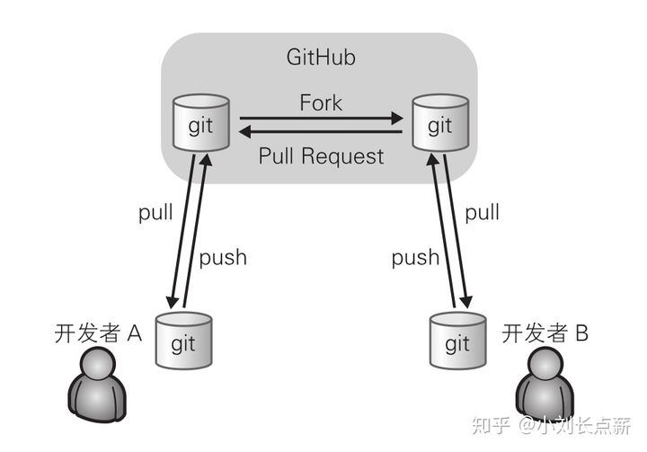

# 这是我的第一个GitHub尝试。

<!--现在找工作真难啊，我挺难受的，这么多年荒废了。要为未来更好的生活而努力奋斗！
-->

<!-- GitHub的具体流程：

-->

OK! LET'S DO THIS.

开始读书 *GitHub入门与实践*

---

# 第一章：欢迎来到GitHub的世界

讲解GitHub是什么，以及有哪些革新之处。
在开源软件的世界中，GitHub为开发者带来了革命性的社会化编程概念。
在这里我们将会接触这一概念，并对其带来的优势与功能进行讲解。

## 什么是GitHub

GitHub是为开发者提供Git仓库的托管服务。
这是一个让开发者与朋友、同事、同学及陌生人共享代码的完美场所。

GitHub的吉祥物octocat章鱼猫

重点知识：GitHub与Git的区别

GitHub与Git是完全不同的两个东西。
在Git中，开发者将源代码存入名叫“Git仓库”的资料库中并加以使用。
而GitHub则是在网络上提供Git仓库的一项服务。
也就是说，GitHub上公开的软件源代码全都由Git进行管理。
理解Git，是熟练运用GitHub的关键所在。

我感觉还是没有讲清楚两者之间的关系，要搞明白两者的关系，最重要的还是理解Git是个什么东西。

## 使用GitHub会带来哪些变化

### 协作形式变化

-在开发者之间引发化学反应的Pull Request

Pull Requset是指开发者在本地对源代码进行更改后，向GitHub中托管的Git仓库请求合并的功能。
开发者可以在Pull Requset上通过评论交流，例如“修正了BUG，可以合并一下吗？”以及“我试着做了这样一个新功能，可以合并一下吗？”等。
通过这个功能，开发者可以轻松更改源代码，并公开更改的细节，然后向仓库提交合并请求。
而且，如果请求的更改与项目的初衷相违，也可以选择拒绝合并。

GitHub的Pull Requset不但能轻松查看源代码的前后差别，还可以对指定的一行代码进行评论。通过这一功能，开发者们可以针对具体的代码进行讨论，使代码审查的工作变得前所未有地惬意。

-对特定用户进行评论

-GitHub Flavored Markdown

### 能看到更多其他团队的软件

### 与开源软件相同的开发模式

## 社会化编程

## 为什么需要社会化编程

### 不要闭目塞听，要接触不同的文化

### 会写代码的程序员更受青睐

### GitHub最大的特征是“面向人”
GitHub除项目之外，还可以把注意力集中到人身上。
我们不但能阅览一个人公开的所有源代码，只要查看其控制面板中的News Feed，还能知道他对哪些仓库感兴趣，什么时候做过提交等。
一个人在GitHub进行的开发是一目了然的。
## 1.5 GitHub提供的主要功能
### * Git仓库
一般情况下，我们可以免费建立人一个GitHub提供的Git仓库。
### * Organization
通常来说，个人使用时只要使用个人账户就足够了额，但如果是公司，建议使用Organization账户。它的优点在于可以统一管理账户和权限，还能统一支付一些费用。
### * Issue
Issue功能，是将一个任务或问题分配给一个Issue进行追踪和管理的功能。
可能像BUG管理系统或TiDD的Ticket一样使用。
在GitHub上，每当进行我们即将讲解的Pull Request，都会同时创建一个Issue。

每一个功能更改或修正都对应一个Issue，讨论或修正都以这个Issue为中心进行。
只要查看Issue，就能知道和这个更改相关的一切信息，并以此进行管理。

在Git的提交信息中写上Issue的ID（例如“#7”），GitHub就会自动生成从Issue到对应提交的链接。
另外，只要按照特定的格式描述提交信息，还可以关闭Issue。
### * Wiki
### * Pull Request
---
# 第2章 Git的导入
Git仓库管理功能是GitHub的核心。因此，使用GitHub之前必须先掌握Git的相关知识，同时本地的设备还要安装Git环境。
## 2.1 诞生背景
Git属于分散型版本管理系统，是为版本管理而设计的软件。
## 2.2 什么是版本管理
版本管理就是管理更新的历史记录。它为我们提供了一些在软件开发过程中必不可少的功能，例如记录一款软件添加或更改源代码的过程，回滚到特定阶段，恢复误删除的文件等。
### 集中型与分散型
### *集中型
将仓库集中存放在服务器之中，所以只存在一个仓库。
这就是为什么这种版本管理系统会被称作为集中型。

集中型将所有数据集中村房子啊服务器当中，有便于管理的优点。
但是一旦开发者所处的环境不能链接服务器，就无法获取最新的源代码，开发也就几乎无法进行。
服务器宕机时也是同样的道理，而且万一服务器故障导致数据消失，恐怕开发者就再也见不到最新的源代码了。
### *分散型
GitHub将仓库Fork给了每一个用户。
Fork就是将GitHub的某个特定仓库复制到自己的账户下。
Fork出的仓库与原仓库是两个不同的仓库，开发者可以随意编辑。

分散型拥有多个仓库，相对而言稍显复杂。
不过，由于本地的开发环境中就有仓库，所以开发者不必链接远程仓库就可以进行开发。

### 集中型与分散型哪个更好

## 2.3 安装
这部分的内容不重要，我直接下载了安装包，傻瓜式的next到了最后。
## 2.4 初始设置
下面我们对本地计算机里安装的Git进行设置。
### 设置姓名和邮箱地址
首先来设置使用Git时的姓名和邮箱地址。
名字请用英文输入。

> git config --global user.name "Firstname Lastname"

> git config --global user.email "your_email@example.com"
### 提高命令输出的可读性
> git config --global color.ui auto
